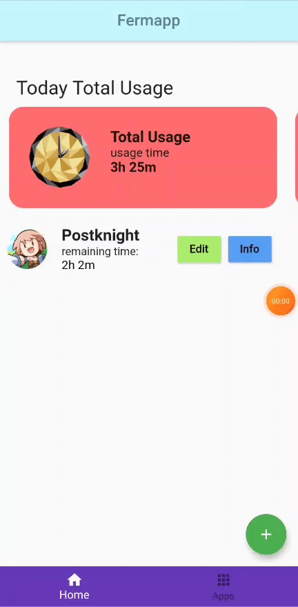

# fermapp

Time management application using Flutter.

## How it works
A scheduler (run every 5 seconds) will check if an application's remaining time (timeLimit - usageTime) is 0 or lower. The scheduler will stop if you close the application, so it's troublesome because you need to open the app first everytime.

## Features
- Set time rule
- Notify when remaining time is 0
- Notify when overall usage time is larger than 10 hours
- List all apps' usage time